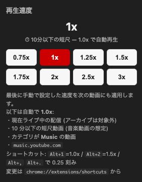

# YouTube Speed Switcher

YouTube の再生速度をワンクリック / ショートカットで切り替える Chrome 拡張機能 (Manifest V3)。




## インストール

1. Chrome で `chrome://extensions` を開く
2. 右上「デベロッパーモード」をオン
3. 「パッケージ化されていない拡張機能を読み込む」をクリック
4. このフォルダ (`youtube-speed`) を選択

## 使い方

### ポップアップ

ツールバーのアイコンをクリックすると 0.75x〜3.0x のプリセットボタンが出ます。

### 自動適用ルール

以下のいずれかに該当する動画は自動で **1.0x** にリセット:

- **現在ライブ中の配信** (`video.duration === Infinity` のみで判定。アーカイブ済みのライブは finite になるので除外される)
- **10 分以下の短尺動画** (音楽動画の代理判定。`video.duration ≤ 600s`)
- **音楽カテゴリ** (`<meta itemprop="genre" content="Music">`)
- **`music.youtube.com`**

それ以外の動画 → 最後に手動で設定した速度を再適用 (デフォルト 1.5x)。

しきい値 (10 分) を変えたい場合は `content.js` 先頭の `SHORT_VIDEO_SEC` 定数を編集してください。

### ショートカット

| キー | 動作 |
| --- | --- |
| `Alt+1` | 1.0x (音楽用) |
| `Alt+2` | 1.5x (動画用) |
| `Alt+.` | 0.25x 速く |
| `Alt+,` | 0.25x 遅く |
| (未割り当て) | 2.0x — `chrome://extensions/shortcuts` から設定 |

ショートカット変更も `chrome://extensions/shortcuts` から可能です。

> Chrome の制約:
> - ショートカットには `Ctrl` または `Alt` が必須 (Shift 単独不可)
> - `suggested_key` で初期割り当てできるのは **最大 4 つ**。それ以上のコマンドは定義のみ可能で、ユーザが手動で割り当てる

## 対応サイト

- `https://www.youtube.com/*`
- `https://m.youtube.com/*`
- `https://music.youtube.com/*`

## ファイル構成

```
youtube-speed/
├── manifest.json   # MV3 設定
├── background.js   # commands → content.js へメッセージ転送
├── content.js      # video.playbackRate を操作、オーバーレイ表示
├── popup.html      # プリセット UI
├── popup.js
└── icons/          # 16/48/128 px の仮アイコン
```
